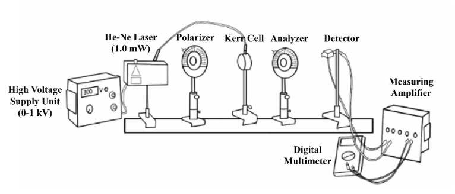
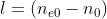
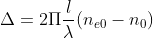
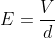
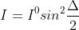
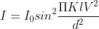
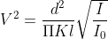
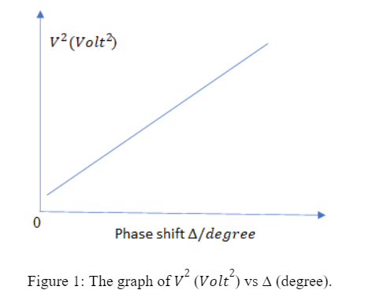
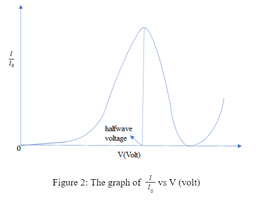

**Apparatus**:  
Kerr cell, PLZT-element, High voltage supply unit (0-1 kV), He-Ne Laser (1.0 mW), 220V
AC Polarizing filter, Digital multimeter.

**Schematic diagram of the experimental setup**:

</img>

**Theory**:  
The Kerr effect is a phenomenon in which the refractive index of a material changes in response to an applied electric field. The effect is named after John Kerr, who first observed it in 1875. The Kerr effect arises from the fact that an applied electric field induces a polarisation in a material. This polarisation causes a change in the electric field that the material experiences, which in turns affects its refractive index. Specifically, the Kerr effect causes the refractive index of a material to change as a function of the square of the electric field strength. The light from the He/Ne laser which is vertically polarized on passing through the polarizer, impinges on the PLZT element which is set in its holder at 45° to the vertical. The incident linearly polarized wave can be regarded as the superimposition of two “in phase” oscillating waves which are polarized, one perpendicularly and the other parallel, to the PLZT element and to the electric field that is applied to the PLZT element. This produces a phase difference between the two waves. For a phase difference between the two waves of λ/2 a linear polarized wave results from the superimposition of the two waves after they have passed through the PLZT element. This linearly polarized wave is turned by 90° with respect to the direction of incidence, e.g. with respect to the vertical. The applied voltage is therefore called the “half-wave voltage”. In this case the light intensity behind the analyzer which is at an angle of 90° to the polarizer will show a maximum.

The light wave, whose field vector oscillates parallel to the electric field, is called the extraordinary beam whereas the wave oscillating perpendicular to the field is known as the ordinary beam. If the corresponding refractive indices are designated by and and l is the distance in the PLZT element covered by the light, then there is a difference in optical paths for the two waves of

</img>

This corresponds to a phase displacement of

</img>

where λ is the wavelength of the light in vacuum; here λ = 633 nm.

It can be shown that the phase displacement is proportional to length l and the square of polarization P. If we anticipate that the polarization is a linear function of the electric field strength E and the proportionality factor is designated by 2πK, then the following relation is obtained:

</img>

K is the Kerr constant.

E can be expressed by the applied voltage V and the inter-electrode distance d

</img>

The luminous intensity I behind the analyzer is obtained for the given experimental apparatus (polarizer and analyzer crossed and at 45° to the electric field on the PLZT element) from the relationship (1):

</img>

I0 is the luminous behind the analyzer when the polarizer and the analyzer are aligned in the same direction and the electric field on the PLZT element is zero. After substituting (2) in (4) and using (3), the followings is obtained:

</img>

Solving the equation for V2 gives:

</img>

By plotting V2against 2 * sin-1√I/I0 , an approximately straight line is obtained and the Kerr constant can be derived from its slope, because the geometrical dimensions l and d for the Kerr cell (PLZT element) are known.

</img>

The graph of I/I0 vs V (volt) is shown in Figure 2. The voltage at which the luminous intensity reaches a maximum for the first time. At this voltage, the normal and extraordinary beams are phase-shifted by 180°. It is, therefore, the ″halfwave voltage ″. It is a function of the PLZT element composition and temperature.

</img>

